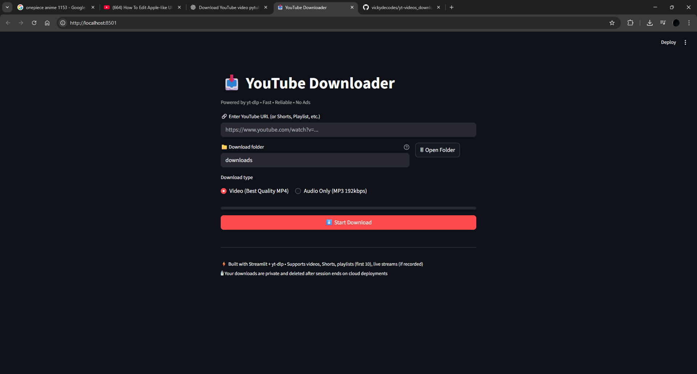
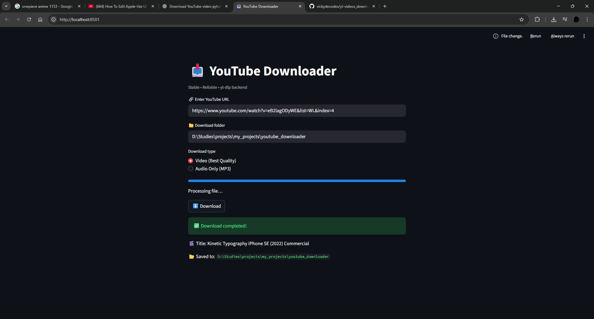

# 📥 YouTube Downloader

A simple and reliable YouTube downloader built using **Streamlit** and **yt-dlp**.
Supports normal videos, YouTube Shorts, playlists, and audio-only downloads.

---

## 🚀 Features

- Download YouTube videos with audio
- Supports YouTube Shorts
- Supports playlists and Watch Later links
- Audio-only download (MP3)
- Live progress bar
- High compatibility MP4 output (H.264 + AAC)

---

## 🛠 Requirements

### Python Dependencies

Install using:

```bash
pip install -r requirements.txt
```

`requirements.txt`

```txt
streamlit>=1.30.0
yt-dlp>=2024.03.10
```

---

### System Dependency (Required)

This project requires **ffmpeg**.

#### Windows

1. Download ffmpeg from:
   https://www.gyan.dev/ffmpeg/builds/
2. Extract it and add `ffmpeg/bin` to your system PATH
3. Verify installation:
   ```bash
   ffmpeg -version
   ```

---

## ▶️ How to Run

From the project directory:

```bash
streamlit run app.py
```

The application will open automatically in your browser.

---

## 📥 How to Use

1. Paste a YouTube video / Shorts / playlist URL
2. Select download type:
   - Video (Best Quality)
   - Audio Only (MP3)
3. Click **Download**
4. File will be saved in the selected folder

---

## 🎞 Media Compatibility

To ensure audio works on all players:

- Video codec: **H.264 (avc1)**
- Audio codec: **AAC (mp4a)**
- Output format: **MP4**

This ensures playback works on:

- Windows Media Player
- VLC
- Browsers
- Mobile devices

---

## 🖼 Screenshots

### Main Interface


### Download in Progress


### Download Completed


## ⚠️ Limitations

- Private videos are not supported
- Age-restricted videos may require cookies
- DRM-protected content cannot be downloaded

---

## 👤 Author

- **Vicky**
- **GitHub** : https://github.com/vickydecodes

## 📄 License

This project is intended for educational and personal use.
Please respect YouTube’s Terms of Service.
